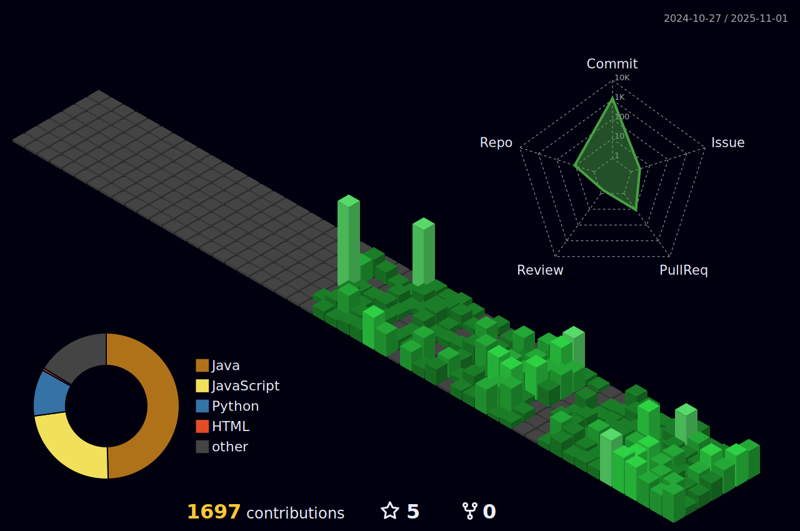

<!-- 잔디 빌딩 

-->

<!-- 뱀 게임 --> 

  

<!-- 유령

  

-->

  <h2>📚 Tech Stack 📚</h2>
  
  <!-- Backend -->
  
  
  
  
  
  
  
   

  <!-- Frontend -->
  
  
  
  
  

<!-- Most uses Laguage & Boj Tier  -->

  <h2>🌱 Langauage & Algorithm 🌱</h2>
  
  

---

  

<!-- 

  
  
  
  
  

-->

<!-- 웨이브 모양 헤더, 푸터
 

-->
